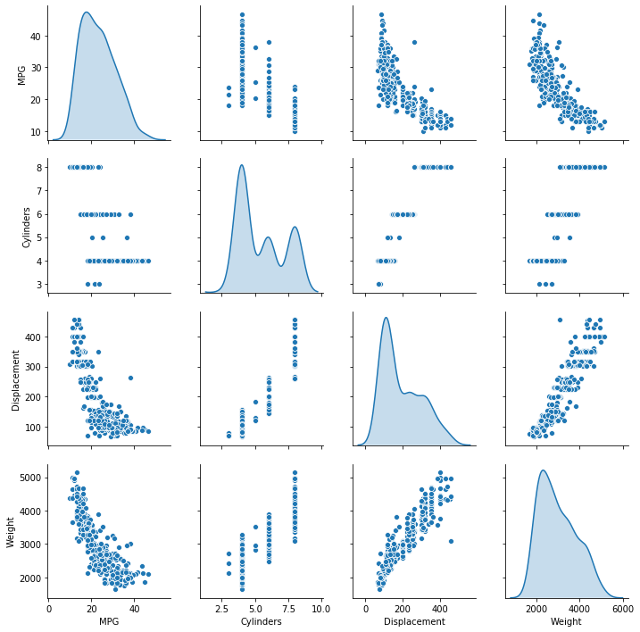

```python
import tensorflow as tf
import numpy as np
import pathlib
import matplotlib.pyplot as plt
import pandas as pd
import seaborn as sns

# 输出一个cel中的全部变量
from IPython.core.interactiveshell import InteractiveShell
InteractiveShell.ast_node_interactivity = 'all'
```


```python
dataset_path = tf.keras.utils.get_file("auto-mpg.data", "http://archive.ics.uci.edu/ml/machine-learning-databases/auto-mpg/auto-mpg.data")
dataset_path
```


    'C:\\Users\\asus\\.keras\\datasets\\auto-mpg.data'


```python
column_names = ['MPG','Cylinders','Displacement','Horsepower','Weight',
                'Acceleration', 'Model Year', 'Origin']
raw_dataset = pd.read_csv(dataset_path, names=column_names,
                      na_values = "?", comment='\t',
                      sep=" ", skipinitialspace=True)

dataset = raw_dataset.copy()
dataset.tail()
```


<div>
<style scoped>
    .dataframe tbody tr th:only-of-type {
        vertical-align: middle;
    }

    .dataframe tbody tr th {
        vertical-align: top;
    }

    .dataframe thead th {
        text-align: right;
    }
</style>
<table border="1" class="dataframe">
  <thead>
    <tr style="text-align: right;">
      <th></th>
      <th>MPG</th>
      <th>Cylinders</th>
      <th>Displacement</th>
      <th>Horsepower</th>
      <th>Weight</th>
      <th>Acceleration</th>
      <th>Model Year</th>
      <th>Origin</th>
    </tr>
  </thead>
  <tbody>
    <tr>
      <th>393</th>
      <td>27.0</td>
      <td>4</td>
      <td>140.0</td>
      <td>86.0</td>
      <td>2790.0</td>
      <td>15.6</td>
      <td>82</td>
      <td>1</td>
    </tr>
    <tr>
      <th>394</th>
      <td>44.0</td>
      <td>4</td>
      <td>97.0</td>
      <td>52.0</td>
      <td>2130.0</td>
      <td>24.6</td>
      <td>82</td>
      <td>2</td>
    </tr>
    <tr>
      <th>395</th>
      <td>32.0</td>
      <td>4</td>
      <td>135.0</td>
      <td>84.0</td>
      <td>2295.0</td>
      <td>11.6</td>
      <td>82</td>
      <td>1</td>
    </tr>
    <tr>
      <th>396</th>
      <td>28.0</td>
      <td>4</td>
      <td>120.0</td>
      <td>79.0</td>
      <td>2625.0</td>
      <td>18.6</td>
      <td>82</td>
      <td>1</td>
    </tr>
    <tr>
      <th>397</th>
      <td>31.0</td>
      <td>4</td>
      <td>119.0</td>
      <td>82.0</td>
      <td>2720.0</td>
      <td>19.4</td>
      <td>82</td>
      <td>1</td>
    </tr>
  </tbody>
</table>
</div>


```python
dataset.isna().sum()
```


    MPG             0
    Cylinders       0
    Displacement    0
    Horsepower      6
    Weight          0
    Acceleration    0
    Model Year      0
    Origin          0
    dtype: int64


```python
dataset = dataset.dropna()
```


```python
dataset['Origin'] = dataset['Origin'].map(lambda x: {1: 'USA', 2: 'Europe', 3: 'Japan'}.get(x))
dataset = pd.get_dummies(dataset, prefix='', prefix_sep='')
dataset.tail()
```


<div>
<style scoped>
    .dataframe tbody tr th:only-of-type {
        vertical-align: middle;
    }

    .dataframe tbody tr th {
        vertical-align: top;
    }

    .dataframe thead th {
        text-align: right;
    }
</style>
<table border="1" class="dataframe">
  <thead>
    <tr style="text-align: right;">
      <th></th>
      <th>MPG</th>
      <th>Cylinders</th>
      <th>Displacement</th>
      <th>Horsepower</th>
      <th>Weight</th>
      <th>Acceleration</th>
      <th>Model Year</th>
      <th>Europe</th>
      <th>Japan</th>
      <th>USA</th>
    </tr>
  </thead>
  <tbody>
    <tr>
      <th>393</th>
      <td>27.0</td>
      <td>4</td>
      <td>140.0</td>
      <td>86.0</td>
      <td>2790.0</td>
      <td>15.6</td>
      <td>82</td>
      <td>0</td>
      <td>0</td>
      <td>1</td>
    </tr>
    <tr>
      <th>394</th>
      <td>44.0</td>
      <td>4</td>
      <td>97.0</td>
      <td>52.0</td>
      <td>2130.0</td>
      <td>24.6</td>
      <td>82</td>
      <td>1</td>
      <td>0</td>
      <td>0</td>
    </tr>
    <tr>
      <th>395</th>
      <td>32.0</td>
      <td>4</td>
      <td>135.0</td>
      <td>84.0</td>
      <td>2295.0</td>
      <td>11.6</td>
      <td>82</td>
      <td>0</td>
      <td>0</td>
      <td>1</td>
    </tr>
    <tr>
      <th>396</th>
      <td>28.0</td>
      <td>4</td>
      <td>120.0</td>
      <td>79.0</td>
      <td>2625.0</td>
      <td>18.6</td>
      <td>82</td>
      <td>0</td>
      <td>0</td>
      <td>1</td>
    </tr>
    <tr>
      <th>397</th>
      <td>31.0</td>
      <td>4</td>
      <td>119.0</td>
      <td>82.0</td>
      <td>2720.0</td>
      <td>19.4</td>
      <td>82</td>
      <td>0</td>
      <td>0</td>
      <td>1</td>
    </tr>
  </tbody>
</table>
</div>


```python

# 分配训练集和测试集
train_dataset = dataset.sample(frac=0.8,random_state=0)
test_dataset = dataset.drop(train_dataset.index)  
```


```python
sns.pairplot(train_dataset[["MPG", "Cylinders", "Displacement", "Weight"]],diag_kind="kde")
```


    <seaborn.axisgrid.PairGrid at 0x1550857d4c8>





```python
train_stats = train_dataset.describe() #基本统计量
train_stats.pop("MPG")
train_stats = train_stats.transpose() # 矩阵转置
train_stats
```


<div>
<style scoped>
    .dataframe tbody tr th:only-of-type {
        vertical-align: middle;
    }

    .dataframe tbody tr th {
        vertical-align: top;
    }

    .dataframe thead th {
        text-align: right;
    }
</style>
<table border="1" class="dataframe">
  <thead>
    <tr style="text-align: right;">
      <th></th>
      <th>count</th>
      <th>mean</th>
      <th>std</th>
      <th>min</th>
      <th>25%</th>
      <th>50%</th>
      <th>75%</th>
      <th>max</th>
    </tr>
  </thead>
  <tbody>
    <tr>
      <th>Cylinders</th>
      <td>314.0</td>
      <td>5.477707</td>
      <td>1.699788</td>
      <td>3.0</td>
      <td>4.00</td>
      <td>4.0</td>
      <td>8.00</td>
      <td>8.0</td>
    </tr>
    <tr>
      <th>Displacement</th>
      <td>314.0</td>
      <td>195.318471</td>
      <td>104.331589</td>
      <td>68.0</td>
      <td>105.50</td>
      <td>151.0</td>
      <td>265.75</td>
      <td>455.0</td>
    </tr>
    <tr>
      <th>Horsepower</th>
      <td>314.0</td>
      <td>104.869427</td>
      <td>38.096214</td>
      <td>46.0</td>
      <td>76.25</td>
      <td>94.5</td>
      <td>128.00</td>
      <td>225.0</td>
    </tr>
    <tr>
      <th>Weight</th>
      <td>314.0</td>
      <td>2990.251592</td>
      <td>843.898596</td>
      <td>1649.0</td>
      <td>2256.50</td>
      <td>2822.5</td>
      <td>3608.00</td>
      <td>5140.0</td>
    </tr>
    <tr>
      <th>Acceleration</th>
      <td>314.0</td>
      <td>15.559236</td>
      <td>2.789230</td>
      <td>8.0</td>
      <td>13.80</td>
      <td>15.5</td>
      <td>17.20</td>
      <td>24.8</td>
    </tr>
    <tr>
      <th>Model Year</th>
      <td>314.0</td>
      <td>75.898089</td>
      <td>3.675642</td>
      <td>70.0</td>
      <td>73.00</td>
      <td>76.0</td>
      <td>79.00</td>
      <td>82.0</td>
    </tr>
    <tr>
      <th>Europe</th>
      <td>314.0</td>
      <td>0.178344</td>
      <td>0.383413</td>
      <td>0.0</td>
      <td>0.00</td>
      <td>0.0</td>
      <td>0.00</td>
      <td>1.0</td>
    </tr>
    <tr>
      <th>Japan</th>
      <td>314.0</td>
      <td>0.197452</td>
      <td>0.398712</td>
      <td>0.0</td>
      <td>0.00</td>
      <td>0.0</td>
      <td>0.00</td>
      <td>1.0</td>
    </tr>
    <tr>
      <th>USA</th>
      <td>314.0</td>
      <td>0.624204</td>
      <td>0.485101</td>
      <td>0.0</td>
      <td>0.00</td>
      <td>1.0</td>
      <td>1.00</td>
      <td>1.0</td>
    </tr>
  </tbody>
</table>
</div>


```python
train_labels = train_dataset.pop('MPG')  # pop是弹出MPG键值的balue
test_labels = test_dataset.pop('MPG')
```


```python
train_dataset
```


<div>
<style scoped>
    .dataframe tbody tr th:only-of-type {
        vertical-align: middle;
    }

    .dataframe tbody tr th {
        vertical-align: top;
    }

    .dataframe thead th {
        text-align: right;
    }
</style>
<table border="1" class="dataframe">
  <thead>
    <tr style="text-align: right;">
      <th></th>
      <th>Cylinders</th>
      <th>Displacement</th>
      <th>Horsepower</th>
      <th>Weight</th>
      <th>Acceleration</th>
      <th>Model Year</th>
      <th>Origin</th>
    </tr>
  </thead>
  <tbody>
    <tr>
      <th>65</th>
      <td>8</td>
      <td>351.0</td>
      <td>153.0</td>
      <td>4129.0</td>
      <td>13.0</td>
      <td>72</td>
      <td>1</td>
    </tr>
    <tr>
      <th>132</th>
      <td>4</td>
      <td>140.0</td>
      <td>75.0</td>
      <td>2542.0</td>
      <td>17.0</td>
      <td>74</td>
      <td>1</td>
    </tr>
    <tr>
      <th>74</th>
      <td>8</td>
      <td>302.0</td>
      <td>140.0</td>
      <td>4294.0</td>
      <td>16.0</td>
      <td>72</td>
      <td>1</td>
    </tr>
    <tr>
      <th>78</th>
      <td>4</td>
      <td>120.0</td>
      <td>87.0</td>
      <td>2979.0</td>
      <td>19.5</td>
      <td>72</td>
      <td>2</td>
    </tr>
    <tr>
      <th>37</th>
      <td>6</td>
      <td>232.0</td>
      <td>100.0</td>
      <td>3288.0</td>
      <td>15.5</td>
      <td>71</td>
      <td>1</td>
    </tr>
    <tr>
      <th>...</th>
      <td>...</td>
      <td>...</td>
      <td>...</td>
      <td>...</td>
      <td>...</td>
      <td>...</td>
      <td>...</td>
    </tr>
    <tr>
      <th>207</th>
      <td>4</td>
      <td>130.0</td>
      <td>102.0</td>
      <td>3150.0</td>
      <td>15.7</td>
      <td>76</td>
      <td>2</td>
    </tr>
    <tr>
      <th>279</th>
      <td>4</td>
      <td>98.0</td>
      <td>68.0</td>
      <td>2135.0</td>
      <td>16.6</td>
      <td>78</td>
      <td>3</td>
    </tr>
    <tr>
      <th>227</th>
      <td>6</td>
      <td>225.0</td>
      <td>100.0</td>
      <td>3630.0</td>
      <td>17.7</td>
      <td>77</td>
      <td>1</td>
    </tr>
    <tr>
      <th>148</th>
      <td>4</td>
      <td>116.0</td>
      <td>75.0</td>
      <td>2246.0</td>
      <td>14.0</td>
      <td>74</td>
      <td>2</td>
    </tr>
    <tr>
      <th>143</th>
      <td>4</td>
      <td>97.0</td>
      <td>78.0</td>
      <td>2300.0</td>
      <td>14.5</td>
      <td>74</td>
      <td>2</td>
    </tr>
  </tbody>
</table>
<p>318 rows × 7 columns</p>
</div>


```python
xx = np.array([[1,2,3],[4,5,6],[7,8,9]])
xx
```


    array([[1, 2, 3],
           [4, 5, 6],
           [7, 8, 9]])


```python
hh = xx.T
hh

```


    array([[1, 4, 7],
           [2, 5, 8],
           [3, 6, 9]])


```python
def norm(x):
  return (x - train_stats['mean']) / train_stats['std']
normed_train_data = norm(train_dataset)
normed_test_data = norm(test_dataset)
normed_test_data
normed_train_data
```


<div>
<style scoped>
    .dataframe tbody tr th:only-of-type {
        vertical-align: middle;
    }

    .dataframe tbody tr th {
        vertical-align: top;
    }

    .dataframe thead th {
        text-align: right;
    }
</style>
<table border="1" class="dataframe">
  <thead>
    <tr style="text-align: right;">
      <th></th>
      <th>Acceleration</th>
      <th>Cylinders</th>
      <th>Displacement</th>
      <th>Europe</th>
      <th>Horsepower</th>
      <th>Japan</th>
      <th>MPG</th>
      <th>Model Year</th>
      <th>USA</th>
      <th>Weight</th>
    </tr>
  </thead>
  <tbody>
    <tr>
      <th>9</th>
      <td>-2.530891</td>
      <td>1.483887</td>
      <td>1.865988</td>
      <td>-0.465148</td>
      <td>2.234620</td>
      <td>-0.495225</td>
      <td>NaN</td>
      <td>-1.604642</td>
      <td>0.774676</td>
      <td>1.018782</td>
    </tr>
    <tr>
      <th>25</th>
      <td>-0.559020</td>
      <td>1.483887</td>
      <td>1.578444</td>
      <td>-0.465148</td>
      <td>2.890853</td>
      <td>-0.495225</td>
      <td>NaN</td>
      <td>-1.604642</td>
      <td>0.774676</td>
      <td>1.925289</td>
    </tr>
    <tr>
      <th>28</th>
      <td>1.054328</td>
      <td>1.483887</td>
      <td>1.041693</td>
      <td>-0.465148</td>
      <td>2.313368</td>
      <td>-0.495225</td>
      <td>NaN</td>
      <td>-1.604642</td>
      <td>0.774676</td>
      <td>2.063931</td>
    </tr>
    <tr>
      <th>31</th>
      <td>-0.559020</td>
      <td>-0.869348</td>
      <td>-0.789008</td>
      <td>-0.465148</td>
      <td>-0.259066</td>
      <td>2.012852</td>
      <td>NaN</td>
      <td>-1.332580</td>
      <td>-1.286751</td>
      <td>-0.903250</td>
    </tr>
    <tr>
      <th>33</th>
      <td>-0.917542</td>
      <td>0.307270</td>
      <td>0.351586</td>
      <td>-0.465148</td>
      <td>-0.127819</td>
      <td>-0.495225</td>
      <td>NaN</td>
      <td>-1.332580</td>
      <td>0.774676</td>
      <td>-0.422150</td>
    </tr>
    <tr>
      <th>...</th>
      <td>...</td>
      <td>...</td>
      <td>...</td>
      <td>...</td>
      <td>...</td>
      <td>...</td>
      <td>...</td>
      <td>...</td>
      <td>...</td>
      <td>...</td>
    </tr>
    <tr>
      <th>369</th>
      <td>0.875068</td>
      <td>-0.869348</td>
      <td>-0.798593</td>
      <td>-0.465148</td>
      <td>-0.442811</td>
      <td>-0.495225</td>
      <td>NaN</td>
      <td>1.660094</td>
      <td>0.774676</td>
      <td>-0.705359</td>
    </tr>
    <tr>
      <th>375</th>
      <td>-0.092942</td>
      <td>-0.869348</td>
      <td>-0.865687</td>
      <td>2.143005</td>
      <td>-0.810302</td>
      <td>-0.495225</td>
      <td>NaN</td>
      <td>1.660094</td>
      <td>-1.286751</td>
      <td>-1.197124</td>
    </tr>
    <tr>
      <th>382</th>
      <td>0.480693</td>
      <td>-0.869348</td>
      <td>-0.836932</td>
      <td>-0.465148</td>
      <td>-0.915299</td>
      <td>2.012852</td>
      <td>NaN</td>
      <td>1.660094</td>
      <td>-1.286751</td>
      <td>-0.883106</td>
    </tr>
    <tr>
      <th>384</th>
      <td>0.050467</td>
      <td>-0.869348</td>
      <td>-0.999874</td>
      <td>-0.465148</td>
      <td>-0.994047</td>
      <td>2.012852</td>
      <td>NaN</td>
      <td>1.660094</td>
      <td>-1.286751</td>
      <td>-1.214899</td>
    </tr>
    <tr>
      <th>396</th>
      <td>1.090181</td>
      <td>-0.869348</td>
      <td>-0.721914</td>
      <td>-0.465148</td>
      <td>-0.679055</td>
      <td>-0.495225</td>
      <td>NaN</td>
      <td>1.660094</td>
      <td>0.774676</td>
      <td>-0.432815</td>
    </tr>
  </tbody>
</table>
<p>78 rows × 10 columns</p>
</div>


<div>
<style scoped>
    .dataframe tbody tr th:only-of-type {
        vertical-align: middle;
    }

    .dataframe tbody tr th {
        vertical-align: top;
    }

    .dataframe thead th {
        text-align: right;
    }
</style>
<table border="1" class="dataframe">
  <thead>
    <tr style="text-align: right;">
      <th></th>
      <th>Acceleration</th>
      <th>Cylinders</th>
      <th>Displacement</th>
      <th>Europe</th>
      <th>Horsepower</th>
      <th>Japan</th>
      <th>MPG</th>
      <th>Model Year</th>
      <th>USA</th>
      <th>Weight</th>
    </tr>
  </thead>
  <tbody>
    <tr>
      <th>146</th>
      <td>-0.379759</td>
      <td>-0.869348</td>
      <td>-1.009459</td>
      <td>-0.465148</td>
      <td>-0.784052</td>
      <td>-0.495225</td>
      <td>NaN</td>
      <td>-0.516397</td>
      <td>0.774676</td>
      <td>-1.025303</td>
    </tr>
    <tr>
      <th>282</th>
      <td>0.624102</td>
      <td>-0.869348</td>
      <td>-0.530218</td>
      <td>-0.465148</td>
      <td>-0.442811</td>
      <td>-0.495225</td>
      <td>NaN</td>
      <td>0.843910</td>
      <td>0.774676</td>
      <td>-0.118796</td>
    </tr>
    <tr>
      <th>69</th>
      <td>-0.738281</td>
      <td>1.483887</td>
      <td>1.482595</td>
      <td>-0.465148</td>
      <td>1.447140</td>
      <td>-0.495225</td>
      <td>NaN</td>
      <td>-1.060519</td>
      <td>0.774676</td>
      <td>1.736877</td>
    </tr>
    <tr>
      <th>378</th>
      <td>-0.308055</td>
      <td>-0.869348</td>
      <td>-0.865687</td>
      <td>-0.465148</td>
      <td>-1.099044</td>
      <td>-0.495225</td>
      <td>NaN</td>
      <td>1.660094</td>
      <td>0.774676</td>
      <td>-1.025303</td>
    </tr>
    <tr>
      <th>331</th>
      <td>0.875068</td>
      <td>-0.869348</td>
      <td>-0.942365</td>
      <td>-0.465148</td>
      <td>-0.994047</td>
      <td>2.012852</td>
      <td>NaN</td>
      <td>1.115971</td>
      <td>-1.286751</td>
      <td>-1.001603</td>
    </tr>
    <tr>
      <th>...</th>
      <td>...</td>
      <td>...</td>
      <td>...</td>
      <td>...</td>
      <td>...</td>
      <td>...</td>
      <td>...</td>
      <td>...</td>
      <td>...</td>
      <td>...</td>
    </tr>
    <tr>
      <th>281</th>
      <td>0.946772</td>
      <td>0.307270</td>
      <td>0.044872</td>
      <td>-0.465148</td>
      <td>-0.521559</td>
      <td>-0.495225</td>
      <td>NaN</td>
      <td>0.843910</td>
      <td>0.774676</td>
      <td>-0.000298</td>
    </tr>
    <tr>
      <th>229</th>
      <td>-1.598734</td>
      <td>1.483887</td>
      <td>1.961837</td>
      <td>-0.465148</td>
      <td>1.972127</td>
      <td>-0.495225</td>
      <td>NaN</td>
      <td>0.299787</td>
      <td>0.774676</td>
      <td>1.457223</td>
    </tr>
    <tr>
      <th>150</th>
      <td>-0.021237</td>
      <td>-0.869348</td>
      <td>-0.836932</td>
      <td>-0.465148</td>
      <td>-0.311564</td>
      <td>2.012852</td>
      <td>NaN</td>
      <td>-0.516397</td>
      <td>-1.286751</td>
      <td>-0.710099</td>
    </tr>
    <tr>
      <th>145</th>
      <td>1.233589</td>
      <td>-0.869348</td>
      <td>-1.076553</td>
      <td>-0.465148</td>
      <td>-1.151543</td>
      <td>2.012852</td>
      <td>NaN</td>
      <td>-0.516397</td>
      <td>-1.286751</td>
      <td>-1.169870</td>
    </tr>
    <tr>
      <th>182</th>
      <td>-0.021237</td>
      <td>-0.869348</td>
      <td>-0.846517</td>
      <td>2.143005</td>
      <td>-0.495310</td>
      <td>-0.495225</td>
      <td>NaN</td>
      <td>0.027726</td>
      <td>-1.286751</td>
      <td>-0.623596</td>
    </tr>
  </tbody>
</table>
<p>314 rows × 10 columns</p>
</div>


```python
def build_model():
    model = tf.keras.Sequential([
        tf.keras.layers.Dense(64,activation='relu',input_shape = [len(train_dataset.keys())]) #64是64个节点
        tf.keras.layers.Dense
    ])
```
